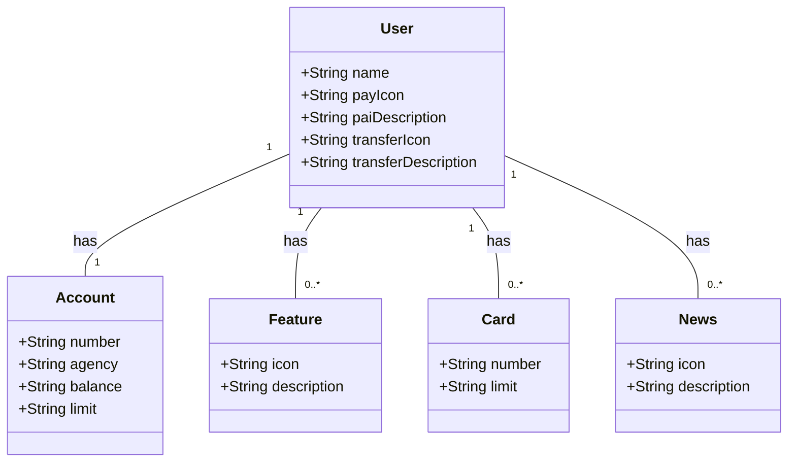

# Desafio de projeto

```mermaid
classDiagram
    class User {
        +String name
        +String payIcon
        +String paiDescription
        +String transferIcon
        +String transferDescription
    }
    
    class Account {
        +String number
        +String agency
        +String balance
        +String limit
    }

    class Feature {
        +String icon
        +String description
    }

    class Card {
        +String number
        +String limit
    }

    class News {
        +String icon
        +String description
    }

    User "1" -- "1" Account : has
    User "1" -- "0..*" Feature : has
    User "1" -- "0..*" Card : has
    User "1" -- "0..*" News : has

```